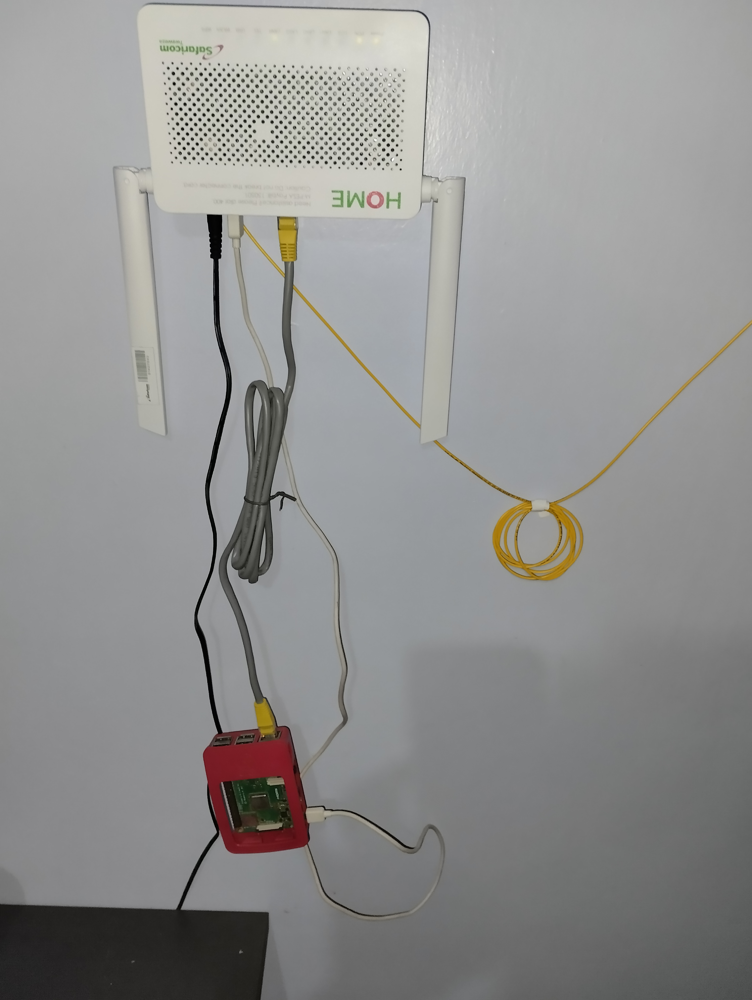

<h1 align="center"><b>Heroku Idler</b></h1>

## <b>Description</b>

Heroku Idler is a python typer cli application that manages a url list of your heroku applications running on [free dynos](https://devcenter.heroku.com/articles/free-dyno-hours) you can then ping these apps every 15 minutes so they never go to sleep and avoid long dyno wake-up time. The CLI is based on [Typer](https://typer.tiangolo.com/), a modern and versatile library for creating CLI applications.

## <b>Prerequisites</b>
- [Python](https://www.python.org/downloads/)

## <b>Setup</b>
<details>
<summary>Click to expand!</summary>

### <b>Clone repository</b>
```bash
$ git clone https://github.com/DanNduati/Heroku_idler.git
```
### <b>Install dependencies</b>
If you have [pipenv](https://pipenv.pypa.io/) installed use:
```bash
$ pipenv install
```
Otherwise you can use the requirements.txt file:
```bash
# create virtualenvironment and activate it
$ python -m venv venv
$ source venv/bin/activate
# install dependencies
$ pip install -r requirements.txt
```
</details>

## <b>Usage</b>
<details>
<summary>Click to expand!</summary>

The application provides the following commands to initialize the app,add and remove urls and ping the urls:

| <b>Command</b>             	| <b>Description</b>                                         	|
|----------------------------	|------------------------------------------------------------	|
| init                       	| Initialises the application’configuration and JSON storage 	|
| add [URL] 	                | Adds a new Heroku app URL                                  	|
| list                       	| Lists all the URLs added                                   	|
| remove [URL_ID]            	| Removes a URL from storage by id                           	|
| ping                       	| Pings the URLs present in the JSON storage                 	|


```bash
# Show a user-friendly help message for usage of the application
$ python -m herokuidler --help
Usage: herokuidler [OPTIONS] COMMAND [ARGS]...

Options:
  --install-completion  Install completion for the current shell.
  --show-completion     Show completion for the current shell, to copy it or
                        customize the installation.
  --help                Show this message and exit.

Commands:
  add     Add a new url
  init    Initialize the url json storage
  list    List all urls
  ping    Ping all urls
  remove  Remove a url using its id

# Initialize the app
$ python -m herokuidler init
use this as the url json storage location? [/home/daniel/.daniel_urls.json]: 
The urls json storage is /home/daniel/.daniel_urls.json

# Run tests
$ python -m pytest -v

# Add a url
$ python -m herokuidler add https://gentle-dusk-50795.herokuapp.com/ping
URL: "https://gentle-dusk-50795.herokuapp.com/ping" was added

# list all urls
$ python -m herokuidler list

Url list:

ID. | Url 
--------------------------------------------------
1   | https://gentle-dusk-50795.herokuapp.com/ping

# Remove a url by its id
$ python -m herokuidler remove 1
Delete url #1: https://gentle-dusk-50795.herokuapp.com/ping? [y/N]: y
url #1: 'https://gentle-dusk-50795.herokuapp.com/ping' was removed

# Ping all the urls added
$ python -m herokuidler ping
Pinging url# 1: https://gentle-dusk-50795.herokuapp.com/ping
https://gentle-dusk-50795.herokuapp.com/ping responded with : 200
Pinging url# 2: https://fastapi-dan.herokuapp.com/
https://fastapi-dan.herokuapp.com/ responded with : 200
```
</details>

## <b>Scheduling</b>
<details>
<summary>Click to expand!</summary>

Since apps using free web dynos sleep after 30 minutes of inactivity I use the [Cron](https://en.wikipedia.org/wiki/Cron) job scheduler to run the ping cli command of the application that pings my applications every 15 minutes
> :warning: **The cron service is only available for Unix-base systems!** checkout the windows equivalent to a cron job called a [scheduled task](https://active-directory-wp.com/docs/Usage/How_to_add_a_cron_job_on_Windows/Scheduled_tasks_and_cron_jobs_on_Windows/)

### <b>Scheduling the worker</b>
Each user in a Unix system has the option to set up scheduled commands that are executed by the system in a "crontab" (cron table) file. The crontab command is used to open a text editor on the user's crontab file:
```bash
$ crontab -e
```
The crontab -e command will start a text editor on the user's crontab file, which will initially be empty, aside from some explanatory comments. A scheduled job is given in the crontab file as a line with six fields. The first five fields are used to set up the run scheduled for the job. The sixth and last field is the command to run. You can configure multiple jobs, each with its own schedule by writing multiple lines in the crontab file.
```bash
┌───────────── minute (0 - 59)
│ ┌───────────── hour (0 - 23) 
│ │ ┌───────────── day of month (1 - 31)
│ │ │ ┌───────────── month (1 - 12)
│ │ │ │ ┌───────────── day of week (0 - 6) (Sunday to Saturday;
│ │ │ │ │                                       7 is also Sunday on some systems)
│ │ │ │ │
│ │ │ │ │
* * * * *  command to execute
```
To run the cli ping command at every 15th minute past every hour from 6am to midnight (maintain the 18 hr quota). add this to your crontab file:
```bash

*/15 6-23,0 * * * cd <path to cli application> && <path to your virtual environment python executabl> -m herokuidler ping
```
In my case the worker runs on my raspberry pi it has way better uptime than my laptop :):
```bash
*/15 6-23,0 * * * cd /home/pi/Desktop/heroku_idler && /home/pi/.local/share/virtualenvs/heroku_idler-Y8-KEVQ5/bin/python -m herokuidler ping
```
<p align="center">

</p>

**But there's a catch** [here](https://devcenter.heroku.com/articles/free-dyno-hours)
>Personal accounts are given a base of 550 free dyno hours each month. In addition to these base hours, accounts which verify with a credit card will receive an additional 450 hours added to the monthly free dyno quota. This means you can receive a total of 1000 free dyno hours per month, if you verify your account with a credit card.

So add your billing information and just like that you have 1000 hours of free dyno use a month!

Do the math: `31 days x 24 hours = 744 hours` which is less than the 1000 hrs so we can have a free dyno that runs all the time for free to do what we want and still have other apps that use the remainder!
</details>

## <b>Built with</b>
- [Typer](https://typer.tiangolo.com/)

## <b>References</b>
- [Build a Command-Line To-Do App With Python and Typer](https://realpython.com/python-typer-cli/)
- [Online Crontab Editor](https://crontab.guru/)

## <b>Todo</b>
- [ ] Logging
- [ ] Add a sleep functionality for known low-use periods (ie, overnight) lol to manage quota for many apps 

## <b>License</b>
[](LICENSE)
